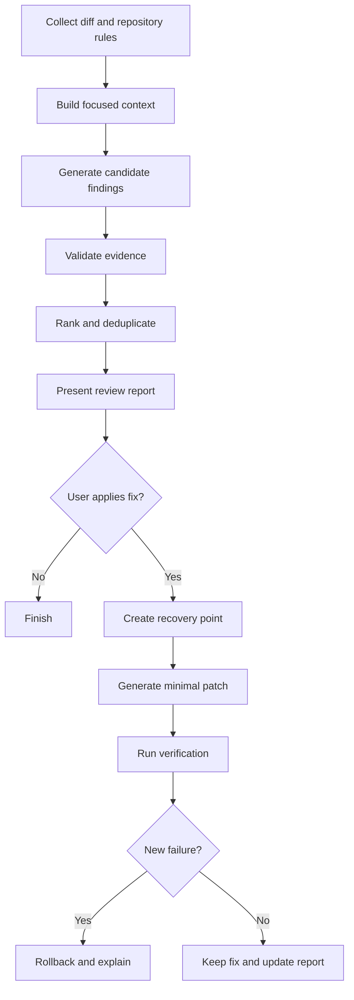

# HypMind Review + Autofix

## Product and Implementation Plan

**Status:** Proposed  
**Recommended priority:** Next major paid feature  
**Target:** CLI and VS Code first; GitHub integration after local validation  
**Primary users:** Individual developers, small teams, and maintainers reviewing pull requests  
**Assumption:** This document uses **HypMind** as the product name. If **HiveMind** remains the final name, only product-facing labels and commands need to change.

---

## 1. Executive Summary

HypMind should next ship an **on-demand code-review and verified-autofix system**.

The feature reviews a local Git diff or pull request, reports evidence-backed bugs, and allows the user to apply selected fixes inside a recoverable transaction. Every applied fix is followed by targeted verification such as formatting, linting, type-checking, compilation, and tests.

The initial product should feel simple:

```bash
hypmind review
hypmind fix HM-003
```

The difficult behavior remains behind the interface:

1. Understand the changed code and its dependencies.
2. Identify likely correctness, security, performance, and regression problems.
3. Reject weak or unsupported findings.
4. Generate the smallest safe patch.
5. Verify that the patch does not introduce new failures.
6. Let the user inspect, accept, undo, or publish the result.

This is a suitable next feature because it builds on HypMind's existing strengths: Rust-based execution, workspace-jailing, shell approvals, session persistence, undo, structured tool results, cost tracking, project context, and conflict-aware parallel tools.

It is also easier and cheaper to launch than a full cloud background agent.

---

## 2. Product Positioning

### Recommended promise

> **HypMind reviews, verifies, and safely fixes your code before it reaches production.**

### Differentiation

HypMind should not compete only on model intelligence. Models change quickly and are available to many competitors. The defensible value should be the execution system around the model:

- Local-first review for privacy and speed.
- Evidence required for every reported issue.
- Baseline-versus-introduced failure classification.
- Isolated and recoverable fixes.
- Transparent model and cost reporting.
- Bring-your-own-key and local-model support.
- Consistent operation from CLI, VS Code, CI, and later GitHub.

### Why this feature now

Major coding-agent products are converging on several market expectations:

- Pull-request review with manual and automatic triggering.
- One-click or agent-driven autofix.
- Repository-specific rules such as `AGENTS.md`.
- Skills, hooks, and external-tool connectivity.
- Background work performed in isolated branches or worktrees.

HypMind should implement these in a safe sequence rather than attempt all of them simultaneously.

---

## 3. Goals and Non-Goals

### MVP goals

- Review unstaged, staged, commit, branch, or pull-request diffs.
- Produce structured, evidence-backed findings.
- Support correctness, security, performance, maintainability, and test-gap categories.
- Rank findings by severity and confidence.
- Apply one selected fix at a time.
- Run targeted verification after a fix.
- Distinguish existing failures from failures introduced by HypMind.
- Support complete rollback through the existing undo/snapshot system.
- Stream useful progress within five seconds on a warm project.
- Expose the same review report in CLI, NDJSON, and VS Code.

### Explicit MVP non-goals

- Large multi-agent teams.
- Fully autonomous merging.
- Cross-repository changes.
- Mobile or standalone desktop applications.
- A public plugin marketplace.
- Training a proprietary foundation model.
- Automatically fixing every finding without user approval.
- Replacing established static analyzers.

---

## 4. User Experience

## 4.1 CLI commands

### Review current working-tree changes

```bash
hypmind review
```

### Review staged changes

```bash
hypmind review --staged
```

### Review a branch against its base

```bash
hypmind review --base main
```

### Review a specific commit or range

```bash
hypmind review --commit abc123
hypmind review --range main..feature/auth
```

### Focus the review

```bash
hypmind review --security
hypmind review --performance
hypmind review --tests
```

### Machine-readable output

```bash
hypmind review --format json
hypmind review --format sarif
```

### Apply fixes

```bash
hypmind fix HM-003
hypmind fix HM-003 --preview
hypmind fix --all-safe
hypmind undo
```

`--all-safe` should apply only findings that meet a strict policy:

- High confidence.
- Small and localized patch.
- No public API or schema change.
- No dependency addition.
- Verification command available.
- No secret, authentication, payment, infrastructure, or migration code involved.

## 4.2 Example finding

```text
HM-003  HIGH  Correctness  92% confidence

Possible double charge after provider timeout

payments/retry.rs:118 retries the charge request after any transport
timeout. The provider may already have accepted the first request, but the
retry does not reuse the original idempotency key.

Evidence
- retry_payment() creates a new request ID on every attempt.
- charge() documents the request ID as its idempotency key.
- The timeout branch retries without checking provider status.

Suggested action
Create the idempotency key once before the retry loop and reuse it.

[Preview fix] [Apply fix] [Ignore]
```

## 4.3 VS Code experience

Add a **HypMind Review** panel containing:

- Review summary and risk level.
- Findings grouped by severity.
- File, line, category, confidence, and evidence.
- Inline diff preview for the suggested fix.
- Buttons for `Apply`, `Ignore`, `Explain`, and `Verify`.
- Verification results with baseline comparison.
- Cost, model, elapsed time, and files inspected.

Recommended commands:

- `HypMind: Review Current Changes`
- `HypMind: Review Staged Changes`
- `HypMind: Review Against Main`
- `HypMind: Fix Selected Finding`
- `HypMind: Verify Applied Fixes`
- `HypMind: Undo Last Fix`

The first VS Code version should consume the same NDJSON events as the CLI. Do not create a second review engine in TypeScript.

---

## 5. Review Pipeline



## 5.1 Stage A: Diff acquisition

The review source should be represented by a single internal abstraction:

```rust
enum ReviewTarget {
    WorkingTree,
    Staged,
    Commit { sha: String },
    Range { base: String, head: String },
    PullRequest { provider: ScmProvider, id: String },
}
```

Collect:

- Changed files and hunks.
- Renames, deletions, and binary files.
- Base and head revisions.
- Relevant repository instructions.
- Language and build-system metadata.
- Existing diagnostics when inexpensive.

Hard limits should protect cost and responsiveness:

- Maximum changed files per plan.
- Maximum diff bytes.
- Maximum context tokens.
- Maximum review time.
- Maximum model spend.

If a diff is too large, partition by dependency-aware file groups rather than arbitrary token chunks.

## 5.2 Stage B: Focused context builder

For each changed hunk, retrieve only context that can help validate behavior:

- Enclosing symbol.
- Direct callers and callees.
- Types, interfaces, schemas, and error definitions.
- Related tests.
- Configuration and feature flags.
- Recent repository rules.

Use Tree-sitter and LSP data when available. Fall back to project-map and search tools when semantic services are unavailable.

The context builder should return a traceable context bundle. Every item needs a source path, range, retrieval reason, and content hash. This makes findings debuggable and avoids repeatedly reading identical files.

## 5.3 Stage C: Candidate generation

Ask the model for structured candidates rather than prose. Each candidate must include:

- Category.
- Severity.
- Confidence.
- Changed location.
- Concrete failure scenario.
- Supporting evidence locations.
- Assumptions.
- Suggested validation.
- Optional patch strategy.

The model must be allowed to return zero findings. A clean review is more valuable than fabricated issues.

## 5.4 Stage D: Evidence validation

Before showing a finding, run a separate validation pass using the available code and tools.

Reject or downgrade findings when:

- The cited symbol or behavior does not exist.
- The concern applies only under an impossible type or control-flow state.
- Existing validation already handles the case.
- The finding is purely stylistic but marked as a bug.
- The model cannot describe a concrete failure scenario.
- Evidence exists only outside the repository and cannot be verified.

Where practical, validate with deterministic tools:

- Compiler or type checker.
- Linter or static analyzer.
- Focused test.
- Search for call sites.
- Dependency metadata.
- Schema validation.

## 5.5 Stage E: Rank and deduplicate

Use a score that is understandable and configurable:

```text
priority_score = severity_weight
               × confidence
               × evidence_quality
               × change_relevance
               × reproducibility
```

Merge findings that describe the same root cause. Prefer one strong finding with multiple evidence points over repeated comments on related lines.

---

## 6. Structured Data Model

```rust
struct ReviewReport {
    review_id: ReviewId,
    target: ReviewTarget,
    base_revision: Option<String>,
    head_revision: Option<String>,
    summary: ReviewSummary,
    findings: Vec<ReviewFinding>,
    verification: Option<VerificationReport>,
    usage: UsageSummary,
    created_at: DateTime<Utc>,
}

struct ReviewFinding {
    id: FindingId,
    title: String,
    category: FindingCategory,
    severity: Severity,
    confidence: f32,
    primary_location: CodeLocation,
    evidence: Vec<EvidenceItem>,
    failure_scenario: String,
    assumptions: Vec<String>,
    suggested_action: String,
    validation_plan: Vec<ValidationStep>,
    patch_strategy: Option<PatchStrategy>,
    status: FindingStatus,
}

enum FindingStatus {
    Open,
    Ignored,
    FixPreviewed,
    Fixed,
    VerificationFailed,
    Stale,
}
```

Store the schema with an explicit version so reports remain readable after product updates.

Recommended output envelope:

```json
{
  "schema_version": "1.0",
  "review_id": "review_01J...",
  "event": "review.finding",
  "data": {}
}
```

---

## 7. Autofix Transaction

Every fix should execute as a recoverable transaction.

### Transaction steps

1. Confirm the finding is still valid against the current file hashes.
2. Create a snapshot or isolated Git worktree.
3. Record repository status and baseline diagnostics.
4. Generate the smallest patch that addresses only the selected finding.
5. Apply edits through the existing jailed edit tools.
6. Format only touched files when appropriate.
7. Run targeted verification.
8. Compare results with the baseline.
9. Keep the patch or rollback automatically.
10. Persist an auditable transaction record.

### Required transaction record

- Review and finding IDs.
- Starting commit and dirty-state fingerprint.
- Files changed by HypMind.
- Patch before and after formatting.
- Commands executed.
- Exit codes and summarized output.
- Baseline and post-fix diagnostics.
- Model and cost.
- User approval events.
- Final status: kept, rejected, rolled back, or manually modified.

### Stale finding protection

Never apply a patch solely by line number. Before applying:

- Verify the source content hash.
- Re-resolve the enclosing symbol.
- Re-run the finding validator if the worktree changed.
- Mark the finding `Stale` if its assumptions no longer hold.

---

## 8. Automated Verification

Verification is the main trust feature, not an optional extra.

## 8.1 Verification discovery

Detect commands from:

- `package.json`
- `Cargo.toml`
- `pyproject.toml`
- `go.mod`
- Maven or Gradle files
- Makefiles and task runners
- CI workflows
- Repository rules
- User configuration

Allow repository-specific configuration:

```toml
# .hypmind/config.toml
[verify]
format = ["cargo fmt --check"]
lint = ["cargo clippy --all-targets -- -D warnings"]
typecheck = []
test = ["cargo test --workspace"]
timeout_seconds = 600
```

## 8.2 Baseline comparison

Run the relevant check before and after a fix when the check is sufficiently fast.

Classify outcomes as:

- `passed`
- `existing_failure`
- `introduced_failure`
- `resolved_failure`
- `inconclusive`
- `timed_out`
- `not_configured`

An existing failure should not automatically invalidate a patch. An introduced failure should block the fix by default.

## 8.3 Targeted-first strategy

Run inexpensive checks first:

1. Parse and syntax validation.
2. Formatter check.
3. Focused linter or type check.
4. Tests related to changed symbols.
5. Package or crate tests.
6. Full workspace test suite when requested or required by policy.

This reduces cost and gives faster feedback without falsely claiming complete verification.

---

## 9. Repository Rules and Memory

HypMind should support common instruction formats so adoption does not require rewriting existing repositories:

- `AGENTS.md`
- Nested `AGENTS.md`
- `CLAUDE.md`
- `.github/copilot-instructions.md`
- `.hypmind/rules/*.md`
- `.hypmind/config.toml`

Precedence should be deterministic:

1. System safety policy.
2. Organization policy.
3. Repository root rules.
4. Nested directory rules.
5. User instructions for the current review.

Rules must never override workspace boundaries, approval policies, secret protection, or destructive-operation restrictions.

Automatic project memory should be postponed until rules are stable. When added, memory must be visible, editable, scoped to one repository, and removable. Hidden permanent memory will reduce trust.

---

## 10. Architecture Integration

The feature should extend the existing layered architecture rather than create a separate service.

### Suggested modules

```text
harness-review/
  target.rs
  diff.rs
  context.rs
  candidate.rs
  validator.rs
  ranking.rs
  report.rs
  fix.rs
  verify.rs
  policy.rs

harness-agent/
  review_orchestrator.rs
  fix_orchestrator.rs

harness-tools/
  git_diff.rs
  diagnostics.rs
  test_discovery.rs
  worktree.rs

harness-cli/
  commands/review.rs
  commands/fix.rs
```

The exact crate boundary can follow the current workspace conventions. The important rule is that review-domain types should not depend on the CLI or VS Code transport.

### Reuse existing capabilities

- Provider retries and model routing.
- Tool result envelope.
- Conflict keys for file edits.
- Parallel read-only tools.
- Workspace jail.
- Shell approval policy.
- Session persistence.
- Snapshot-based undo.
- Cost reservation and refund.
- NDJSON transport.

### New capabilities required

- Normalized Git diff model.
- Review finding schema.
- Evidence validator.
- Verification discovery and baseline comparison.
- Transactional worktree or strengthened snapshot transaction.
- Review event stream.
- SARIF exporter.
- GitHub App service in the later phase.

---

## 11. Model Strategy

Use model routing by task rather than one expensive model for the entire review.

| Task | Model requirement |
| --- | --- |
| Diff summarization | Fast and inexpensive |
| Context selection | Fast model plus deterministic search |
| Candidate generation | Strong reasoning model |
| Evidence validation | Strong or medium model with tools |
| Patch generation | Strong coding model |
| Report formatting | Fast and inexpensive |

Local models can support diff summarization, simple candidate generation, and private reviews. Strong hosted models can be offered for difficult validation and patch generation.

Always show:

- Selected model.
- Estimated maximum cost before review when meaningful.
- Actual review and fix cost.
- Whether code left the local machine.

---

## 12. Safety Policy

### Always require explicit approval for

- Applying the first fix in a session.
- Running unrecognized shell commands.
- Modifying authentication, payment, secrets, infrastructure, or migrations.
- Adding or upgrading dependencies.
- Network access.
- Publishing commits, branches, comments, or pull requests.

### Never do automatically in the first release

- Merge a pull request.
- Push to a protected branch.
- Disable tests or security controls to make verification pass.
- Rewrite Git history.
- Read outside the workspace.
- Upload secrets or ignored files as model context.

### Prompt-injection protection

Treat repository content, issue text, comments, logs, tool output, and documentation as untrusted data. They may provide task context but must not change safety policy or tool permissions.

---

## 13. GitHub Integration: Phase Two

After local review quality is proven, add an optional GitHub App.

### Triggers

- Comment `@hypmind review`.
- Label `hypmind-review`.
- Manual dashboard action.
- Automatic review on pull-request update for paid teams.

### GitHub behavior

1. Receive and verify the webhook.
2. Fetch PR metadata and the exact head SHA.
3. Create an isolated review job.
4. Check out the repository at the reviewed SHA.
5. Run review with organization policy and cost limit.
6. Publish a summary plus high-confidence inline findings.
7. Publish a check-run result.
8. Offer `@hypmind fix HM-003` or a one-click autofix action.
9. Create a new fix branch by default.
10. Open or update a draft pull request.

### Required GitHub protections

- Minimal App permissions.
- Webhook signature validation.
- Installation and repository allow-lists.
- Per-organization spend caps.
- Idempotency keys for webhook delivery.
- Duplicate diff detection.
- Maximum autofix attempts to prevent loops.
- Complete audit log.

---

## 14. Delivery Plan

The estimates below assume one primary developer and reuse of the existing harness.

## Phase 0: Design and benchmark corpus — 3 to 5 days

- Finalize finding schema.
- Define severity and confidence rules.
- Collect 30 to 50 known-bug diffs across supported languages.
- Record expected findings and known false positives.
- Define review latency and cost budgets.

**Exit criterion:** A versioned test corpus and measurable quality baseline exist.

## Phase 1: Local read-only review — 2 weeks

- Implement review target and Git diff normalization.
- Build focused context retrieval.
- Generate structured findings.
- Add evidence-validation pass.
- Stream CLI and NDJSON events.
- Add Markdown and JSON reports.

**Exit criterion:** `hypmind review --base main` reliably returns structured findings without modifying the repository.

## Phase 2: Verified single-finding autofix — 2 weeks

- Create fix transaction.
- Add stale-finding protection.
- Discover verification commands.
- Add baseline comparison.
- Roll back on introduced failure.
- Connect existing undo support.

**Exit criterion:** A selected finding can be previewed, applied, verified, and completely undone.

## Phase 3: VS Code product surface — 1 week

- Review panel.
- Inline diagnostics.
- Diff preview and apply action.
- Verification and rollback status.
- Cost and model visibility.

**Exit criterion:** The full local workflow is usable without opening a terminal.

## Phase 4: Private beta and quality work — 2 weeks

- Recruit 10 to 20 repositories.
- Measure accepted, ignored, and incorrect findings.
- Improve deduplication and evidence filtering.
- Add language-specific verification adapters.
- Harden large-diff handling and cancellation.

**Exit criterion:** Review precision and reliability meet beta targets.

## Phase 5: GitHub App beta — 2 to 3 weeks

- Webhook service.
- Repository installation and permissions.
- Check runs and inline review comments.
- Mention-triggered reviews.
- Fix branch and draft PR creation.
- Team usage and spend limits.

**Exit criterion:** A GitHub user can request a review and receive a verified fix PR without using the local CLI.

---

## 15. Acceptance Criteria

### Functional

- Reviews working-tree, staged, branch, and commit diffs.
- Every visible bug finding contains a concrete failure scenario and code evidence.
- Findings use stable IDs across the same unchanged diff.
- A user can preview and apply one finding.
- Changed files outside the approved workspace are rejected.
- New verification failures cause automatic rollback by default.
- `hypmind undo` restores all files changed by the last fix transaction.
- CLI, JSON, NDJSON, and VS Code represent the same report.

### Performance

- First progress event within 1 second.
- First useful streamed response within 5 seconds on a warm repository.
- Small reviews complete within 60 seconds at p50 and 120 seconds at p95.
- Cancellation stops model requests, tool work, and verification promptly.
- Repeated reads are avoided through content-hash caching.

### Quality targets for private beta

- At least 70% precision for high-severity findings on the benchmark corpus.
- Fewer than 0.5 low-value findings per clean small PR.
- At least 80% of accepted fixes pass configured verification on the first attempt.
- Zero silent modifications outside the reported patch.
- Zero unapproved pushes or external side effects.

These are starting targets, not marketing claims. Publish performance claims only after measuring real beta repositories.

---

## 16. Testing Strategy

### Unit tests

- Diff parsing, renames, deleted files, and binary files.
- Rule precedence.
- Finding schema serialization.
- Severity and confidence validation.
- Deduplication.
- Baseline classification.
- Transaction state transitions.
- Cost and time limits.

### Integration tests

- Review a fixture repository containing a known bug.
- Apply a valid patch and pass verification.
- Introduce a failing patch and confirm rollback.
- Modify a file after review and reject the stale patch.
- Cancel during model generation and test execution.
- Resume a persisted review session.
- Verify workspace-jail and shell-approval behavior.

### Adversarial tests

- Prompt injection inside source comments.
- Malicious instructions in issue or PR text.
- Symlink and path traversal attempts.
- Secrets in untracked and ignored files.
- Large generated files and minified code.
- Commands designed to modify files outside the workspace.
- Review comments attempting to change system policy.

### Evaluation corpus

Maintain versioned examples containing:

- Real bug-fix commits with the bug reintroduced.
- Clean refactors with no expected finding.
- Security mistakes.
- Concurrency and retry bugs.
- API compatibility regressions.
- Missing validation and error handling.
- Performance regressions.
- False-positive traps.

Track precision, recall where labels permit it, cost, latency, accepted-fix rate, and verification success.

---

## 17. Telemetry and Privacy

Telemetry should be opt-in or clearly disclosed and should not collect source code by default.

Useful product metrics:

- Review started and completed.
- Review target size.
- Time to first response and total time.
- Findings by category and severity.
- Finding previewed, accepted, ignored, or marked incorrect.
- Verification outcome.
- Rollback frequency.
- Model cost and token usage.
- Crash or cancellation reason.

Do not collect:

- Source code.
- Diffs.
- Prompts containing repository content.
- Secrets or environment variables.
- Full command output.

Offer a local export of detailed diagnostic traces that users can inspect before sharing with support.

---

## 18. Pricing and Packaging

### Free

- Limited local reviews each month.
- BYOK and supported local models.
- Manual fixes.
- Basic verification.

### Pro

- Higher or unlimited fair-use local reviews.
- Hosted premium models.
- Full evidence validation.
- Advanced verification and report export.
- Priority model routing.

### Team

- GitHub App reviews.
- Organization rules.
- Automatic PR review.
- Usage limits and audit log.
- Shared configuration.
- Suggested or automatic fix branches.

### Usage-based option

Charge per completed hosted review according to diff size and selected model. Show the maximum reservation before execution and refund unused reservation through the existing billing system.

Do not promise unlimited expensive-model usage until real cost distribution is known.

---

## 19. Main Risks and Mitigations

| Risk | Impact | Mitigation |
| --- | --- | --- |
| Too many false positives | Users stop trusting reviews | Evidence gate, zero-finding permission, beta benchmark |
| Review latency is high | Poor interactive experience | Stream early, focused context, caching, model routing |
| Autofix breaks unrelated code | Loss of trust | Small patches, worktree transaction, baseline verification, rollback |
| Hosted review becomes expensive | Weak unit economics | Spend caps, diff limits, BYOK, local models, tiered routing |
| Repository content injects instructions | Security compromise | Treat content as untrusted, fixed policy boundary, tool permissions |
| Large PR overwhelms context | Incomplete review | Dependency-aware partitions and explicit coverage reporting |
| GitHub automation loops | Repeated changes and cost | Idempotency, patch ID, attempt limit, head-SHA validation |
| Binary distribution is distrusted | Adoption friction | Signed binaries, verified installers, checksum and release provenance |

---

## 20. Features to Build After Product Validation

### 1. Issue-to-PR background agent

Accept a GitHub issue, create an isolated worktree, implement the task, verify it, and open a draft PR. Build this only after review, worktree, verification, cost limits, and rollback are reliable.

### 2. Reusable skills and workflows

Allow repositories to package instructions, scripts, templates, and validators for repeatable tasks. Start with a simple local format; postpone a public marketplace.

### 3. MCP compatibility

Add carefully permissioned MCP clients for external tools and data. Treat MCP as ecosystem compatibility, not the main product differentiator.

### 4. Browser verification

For web applications, run an approved local browser flow, capture console and network errors, and attach screenshots to verification results.

### 5. Team policy and analytics

Provide organization-level policies, allowed models, spending controls, review coverage, acceptance rates, and verification outcomes without collecting source code.

---

## 21. Immediate Engineering Backlog

### P0 — Start here

- [ ] Define `ReviewTarget`, `ReviewReport`, and `ReviewFinding` schemas.
- [ ] Implement normalized Git diff acquisition.
- [ ] Add CLI parsing for `hypmind review`.
- [ ] Emit versioned review events through NDJSON.
- [ ] Build the first context bundle from changed hunks and related symbols.
- [ ] Implement structured candidate generation.
- [ ] Add evidence validation and finding rejection.
- [ ] Render terminal and Markdown reports.
- [ ] Create the first 30-example benchmark corpus.
- [ ] Measure latency, cost, and precision.

### P1 — After read-only review works

- [ ] Add fix preview.
- [ ] Add transaction recovery point.
- [ ] Add stale-finding checks.
- [ ] Discover repository verification commands.
- [ ] Run baseline and post-fix comparisons.
- [ ] Roll back introduced failures.
- [ ] Connect VS Code diagnostics and diff view.

### P2 — After private beta quality is acceptable

- [ ] Create GitHub App.
- [ ] Add webhook idempotency.
- [ ] Publish check runs and inline comments.
- [ ] Add mention-triggered review.
- [ ] Add fix branch and draft PR flow.
- [ ] Add organization spend limits and audit logs.

---

## 22. Final Recommendation

Build **Review + Autofix** as a vertical slice before expanding HypMind horizontally.

The first release should do one job exceptionally well:

> Review the developer's current change, explain only defensible problems, safely fix a selected problem, and prove that the fix did not introduce a new failure.

If users repeatedly trust the findings and keep the fixes, HypMind will have the technical foundation and market proof needed for background issue-to-PR automation. If review precision is weak, multi-agent orchestration or more integrations will only make an unreliable product operate at greater scale.

---

## 23. Market References

- [Cursor Bugbot documentation](https://cursor.com/docs/bugbot)
- [GitHub Copilot cloud agent documentation](https://docs.github.com/en/copilot/concepts/agents/cloud-agent/about-cloud-agent)
- [GitHub `AGENTS.md` support](https://github.blog/changelog/2025-08-28-copilot-coding-agent-now-supports-agents-md-custom-instructions/)
- [Claude Code hooks documentation](https://code.claude.com/docs/en/hooks-guide)
- [Claude Code background-agent update](https://code.claude.com/docs/en/whats-new/2026-w27)
- [Cascade Memories documentation](https://docs.devin.ai/desktop/cascade/memories)

